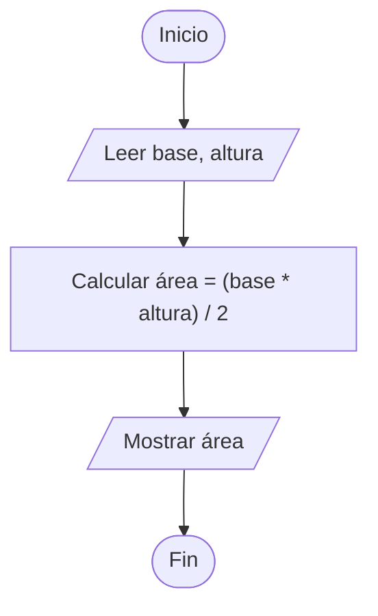
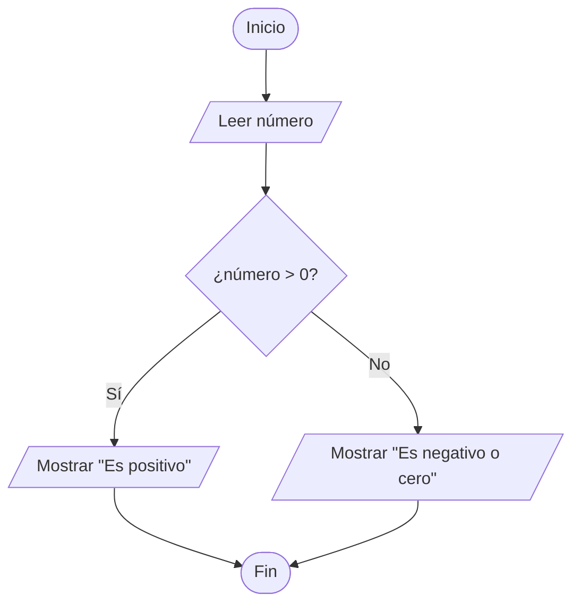
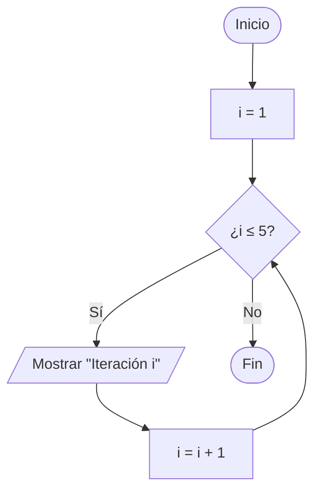
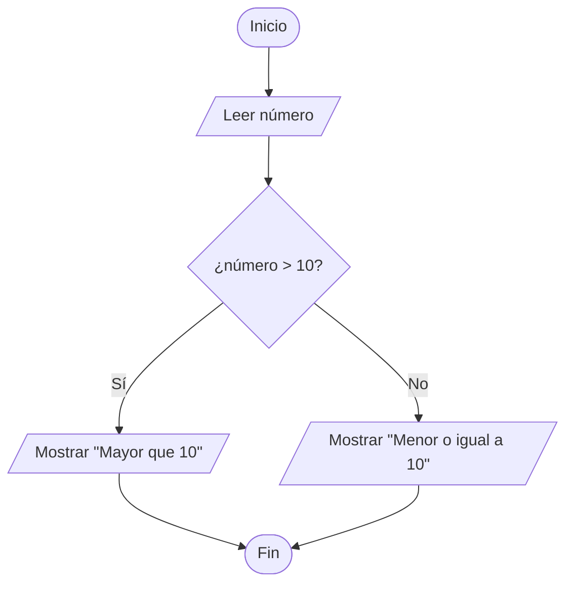
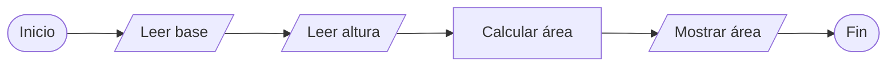
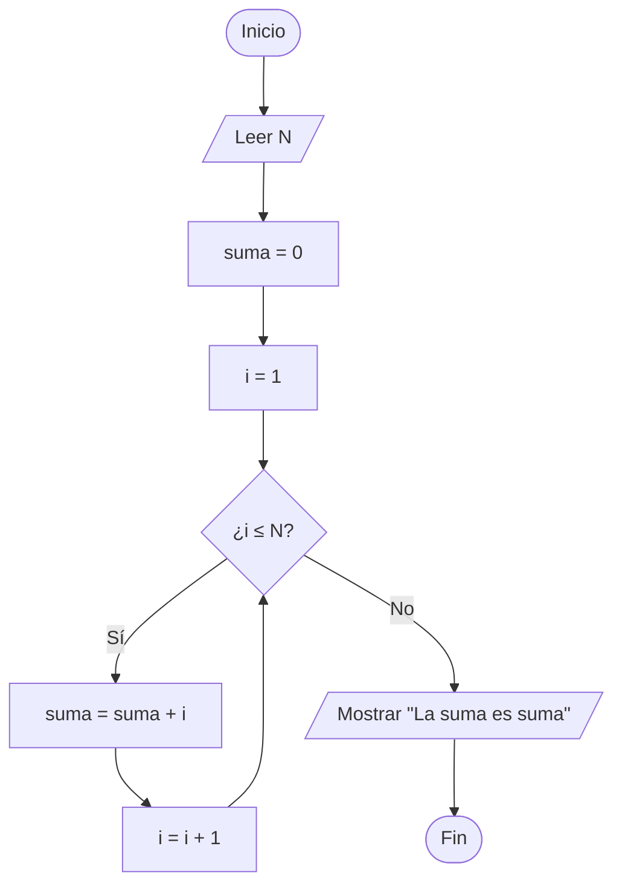

# 🧠 Desarrollo de algoritmos básicos
**Diagramas de flujo, pseudocódigo y su implementación en Bash y PHP**

---

## 1. Introducción y conceptos básicos  

Un **algoritmo** es un conjunto ordenado y finito de pasos que permiten resolver un problema o realizar una tarea.  
Para representar un algoritmo de forma clara, se utilizan herramientas como **diagramas de flujo** y **pseudocódigo**, que facilitan la comprensión antes de implementar el código en un lenguaje de programación.

### 🔹 Conceptos:
- **Algoritmo:** secuencia lógica de pasos para resolver un problema.  
- **Diagrama de flujo:** representación gráfica de un algoritmo mediante símbolos normalizados.  
- **Pseudocódigo:** descripción textual del algoritmo con una estructura similar a un lenguaje de programación.  
- **Estructura secuencial:** ejecución de instrucciones una tras otra.  
- **Estructura condicional:** permite tomar decisiones según una condición.  
- **Estructura repetitiva:** repite un bloque de instrucciones hasta que se cumple una condición.

---

## 2. Identificación de elementos y estructuras principales de un algoritmo  

### 🔹 Explicación:
Todo algoritmo se compone de:
- **Entradas:** datos que el usuario o el sistema proporcionan.  
- **Procesos:** operaciones o transformaciones realizadas sobre las entradas.  
- **Salidas:** resultados obtenidos tras la ejecución.

### 📘 Ejemplo:
**Problema:** Calcular el área de un triángulo.

**Elementos:**
- **Entradas:** base, altura  
- **Proceso:** área = (base × altura) / 2  
- **Salida:** mostrar el valor del área

---

## 3. Elaboración de diagramas de flujo  

### 🔹 Explicación:
Los **diagramas de flujo** utilizan símbolos estandarizados para representar operaciones:

| Símbolo | Significado |
|----------|-------------|
| ( ) **Óvalo** | Terminal: Inicio / Fin |
| [ ] **Rectángulo** | Proceso o cálculo |
| <> **Rombo** | Decisión (condicional) |
| / / **Romboide** | Entrada / Salida de datos |
| ➡️ **Flechas** | Dirección del flujo |

### 🧩 Ejemplo de diagrama de flujo (Mermaid)
🔗 [Editar en MermaidChart](https://mermaidchart.com)


---

## 4. Uso correcto de pseudocódigo y equivalencias  

### 🧩 Estructura secuencial

**Diagrama de flujo (Mermaid):**

🔗 [Editar en MermaidChart](https://mermaidchart.com)


**Pseudocódigo:**

```
Inicio
  Leer base
  Leer altura
  area ← (base * altura) / 2
  Escribir "El área del triángulo es ", area
Fin
```

**Bash:**

```bash
#!/bin/bash
read -p "Introduce la base: " base
read -p "Introduce la altura: " altura
area=$(echo "scale=2; ($base * $altura) / 2" | bc)
echo "El área del triángulo es $area"
```

**PHP:**

```php
<?php
$base = readline("Introduce la base: ");
$altura = readline("Introduce la altura: ");
$area = ($base * $altura) / 2;
echo "El área del triángulo es $area\n";
?>
```

---

### 🧩 Estructura condicional

**Diagrama de flujo (Mermaid):**

🔗 [Editar en MermaidChart](https://mermaidchart.com)



**Pseudocódigo:**

```
Inicio
  Leer número
  Si número > 0 Entonces
      Escribir "Es positivo"
  SiNo
      Escribir "Es negativo o cero"
  FinSi
Fin
```

**Bash:**

```bash
#!/bin/bash
read -p "Introduce un número: " numero
if [ $numero -gt 0 ]; then
  echo "Es positivo"
else
  echo "Es negativo o cero"
fi
```

**PHP:**

```php
<?php
$numero = readline("Introduce un número: ");
if ($numero > 0) {
    echo "Es positivo\n";
} else {
    echo "Es negativo o cero\n";
}
?>
```

---

### 🧩 Estructura repetitiva

**Diagrama de flujo (Mermaid):**

🔗 [Editar en MermaidChart](https://mermaidchart.com)



**Pseudocódigo:**

```
Inicio
  Para i ← 1 Hasta 5 Hacer
      Escribir "Iteración ", i
  FinPara
Fin
```

**Bash:**

```bash
#!/bin/bash
for ((i=1; i<=5; i++)); do
  echo "Iteración $i"
done
```

**PHP:**
```php
<?php
for ($i = 1; $i <= 5; $i++) {
    echo "Iteración $i\n";
}
?>
```

---

## 5. Relación y traducción entre diagramas de flujo y pseudocódigo  

Cada **bloque del diagrama de flujo** puede traducirse a una **línea de pseudocódigo**:

| Diagrama de flujo | Pseudocódigo |
|--------------------|--------------|
| Leer dato | `Leer variable` |
| Calcular operación | `variable ← expresión` |
| Decisión | `Si ... Entonces ... FinSi` |
| Repetición | `Para ... FinPara` o `Mientras ... FinMientras` |

**Ejemplo combinado (Mermaid):**

🔗 [Editar en MermaidChart](https://mermaidchart.com)



---

## 6. Análisis y corrección de errores en algoritmos  

**Diagrama de flujo (Mermaid):**

🔗 [Editar en MermaidChart](https://mermaidchart.com)



**Pseudocódigo:**

```
Inicio
  Leer base
  Leer altura
  area ← (base * altura) / 2
  Escribir "Área: ", area
Fin
```

**Bash:**

```bash
#!/bin/bash
read -p "Introduce la base: " base
read -p "Introduce la altura: " altura
area=$(echo "scale=2; ($base * $altura) / 2" | bc)
echo "Área: $area"
```

**PHP:**

```php
<?php
$base = readline("Introduce la base: ");
$altura = readline("Introduce la altura: ");
$area = ($base * $altura) / 2;
echo "Área: $area\n";
?>
```

---

## 7. Resolución de problemas mediante diseño de algoritmos  

**Diagrama de flujo (Mermaid):**

🔗 [Editar en MermaidChart](https://mermaidchart.com)



**Pseudocódigo:**

```
Inicio
  Leer N
  suma ← 0
  Para i ← 1 Hasta N Hacer
      suma ← suma + i
  FinPara
  Escribir "La suma es ", suma
Fin
```

**Bash:**

```bash
#!/bin/bash
read -p "Introduce un número N: " N
suma=0
for ((i=1; i<=N; i++)); do
  suma=$((suma + i))
done
echo "La suma es $suma"
```

**PHP:**

```php
<?php
$N = readline("Introduce un número N: ");
$suma = 0;
for ($i = 1; $i <= $N; $i++) {
    $suma += $i;
}
echo "La suma es $suma\n";
?>
```

---

## 🔗 Recursos recomendados
- [Símbolos de diagramas de flujo - ISO 5807](https://es.wikipedia.org/wiki/Diagrama_de_flujo)  
- [Pseudocódigo estructurado - Wikilibros](https://es.wikibooks.org/wiki/Algoritmia/Pseudoc%C3%B3digo)  
- [MermaidChart: Representación de diagramas de flujo Mermaid](https://mermaidchart.com)
- [Draw.io: Editor gratuito de diagramas de flujo](https://www.drawio.com/)
- [Flowgorithm: Editor gratuito de diagramas de flujo](http://www.flowgorithm.org/)
- [Visualgo.net: Representación visual de algoritmos](https://visualgo.net/)  