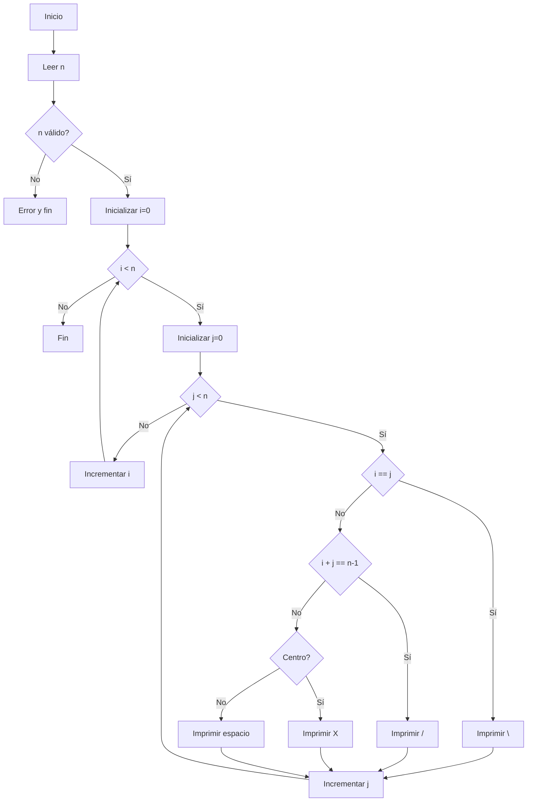
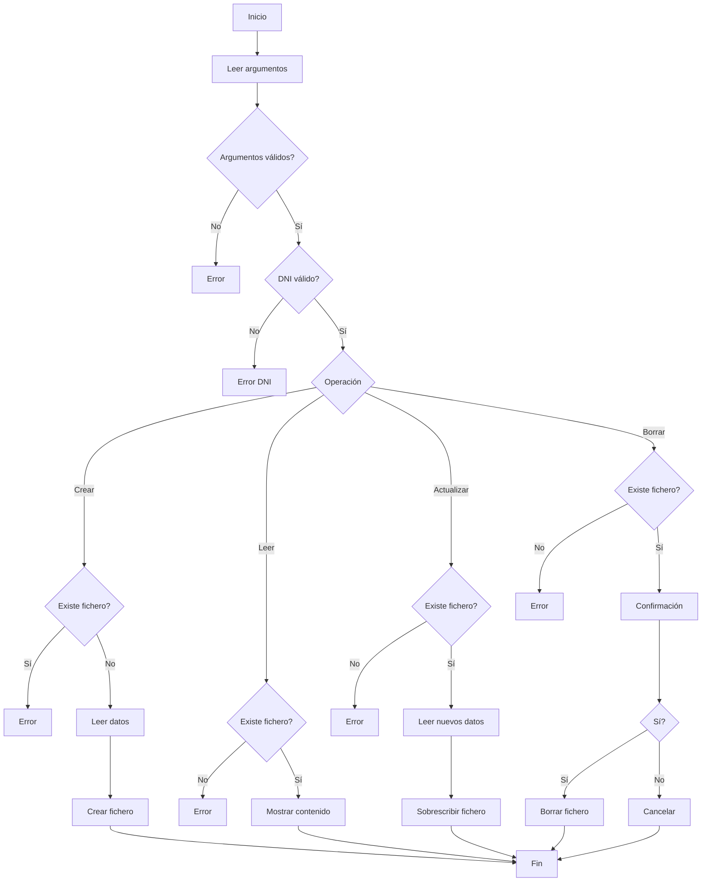

# Soluciones RA3 y RA4 (ASIR)

## RA3.1 – Validar número natural

```bash
#!/bin/bash

if [[ "$1" == "-h" || "$1" == "--help" ]]; then
    echo "Uso: $0 [NUMERO]"
    echo "Valida si el argumento es un número natural mayor que 0."
    echo "Ejemplo: $0 25"
    exit 0
fi

if [[ $# -ne 1 ]]; then
    echo "Error: se requiere exactamente 1 argumento."
    exit 1
fi

num="$1"

if [[ $num =~ ^[1-9][0-9]*$ ]]; then
    echo "Es un número natural válido"
else
    echo "No es un número natural"
fi
```

---

## RA3.2 – Dibujar X

```bash
#!/bin/bash

declare i=0 j=0
declare m=0 n=0
declare natural=true

while $natural; do

    read -p "Introduce tamaño n: " n

    if ! [[ $n =~ ^[1-9][0-9]*$ ]]; then
        natural=false
    else
        for ((i=0; i<n; i++)); do
            for ((j=0; j<n; j++)); do
                if (( n % 2 == 1 && i == n/2 && j == n/2 )); then
                    echo -n "X"
                elif (( i == j )); then
                    echo -n "\\"
                elif (( i + j == n - 1 )); then
                    echo -n "/"
                else
                    echo -n " "
                fi
            done
            echo
        done
        (( m++ ))
    fi
done

echo "Hemos dibujado $m X"
```

### Diagrama de flujo



---

## RA3.3 – CRUD alumnos

```bash
#!/bin/bash

DIR="Alumnos"
mkdir -p "$DIR"

validar_dni() {
    [[ $1 =~ ^[0-9]{8}[A-Za-z]$ ]]
}

if [[ $# -lt 2 ]]; then
    echo "Error argumentos"
    exit 1
fi

op="$1"
dni="$2"
file="$DIR/$dni.txt"

if ! validar_dni "$dni"; then
    echo "DNI inválido"
    exit 2
fi

case "$op" in
    -c)
        [[ -f $file ]] && exit 3
        read -p "NUSS: " nuss
        read -p "Nombre: " nombre
        echo "$dni" > "$file"
        echo "$nuss" >> "$file"
        echo "$nombre" >> "$file"
        ;;
    -l)
        [[ ! -f $file ]] && exit 4
        cat "$file"
        ;;
    -a)
        [[ ! -f $file ]] && exit 5
        read -p "NUSS: " nuss
        read -p "Nombre: " nombre
        echo "$dni" > "$file"
        echo "$nuss" >> "$file"
        echo "$nombre" >> "$file"
        ;;
    -b)
        [[ ! -f $file ]] && exit 6
        read -p "Confirmar (s/n): " c
        [[ $c == "s" ]] && rm "$file"
        ;;
    *)
        echo "Opción inválida"
        exit 7
        ;;
esac
```

### Diagrama de flujo CRUD


