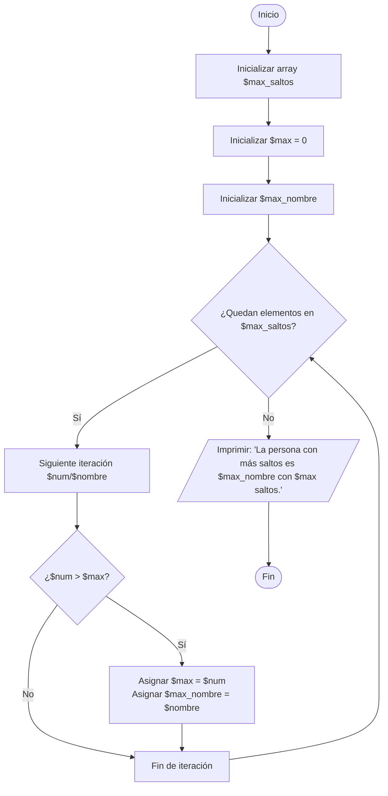

# Examen — RA1 y RA2  
**Asignatura:** Programación y Documentación — 1ª evaluación  
**Fecha:** 21/11/2025

## 1) RA1 — Conceptos fundamentales de la programación

### El siguiente array recoge las notas sobre 10 de los exámenes de la primera evaluación del alumno Manolo:

```php
$notas_manolo = [ 5, 8, 1, 3, 7, 2 ];
```

**Se pide:**

#### 1. (2 p). Escribe una línea en PHP que vuelque por pantalla el valor del quinto examen.

```php
echo $notas_manolo[4] . "\n";
```

#### 2. (2 p). Escribe un bucle en PHP que saque por pantalla todas las notas de Manolo.

```php
// V1
echo "Notas de Manolo:\n";
foreach($notas_manolo as $nota) {
    echo $nota . "\n";
}
```

```php
// V2
$i = 1;
foreach($notas_manolo as $nota) {
    echo "Examen $i: $nota\n";
    $i = $i + 1;
}
```

```php
// V3
$i = 1;
foreach($notas_manolo as $nota) {
    echo "Examen " . ($i++) . ": " . $nota . "\n";
}
```

```php
// V4
foreach($notas_manolo as $i => $nota) {
    echo "Examen " . ($i + 1) . ": " . $nota . "\n";
}
```

```php
// V5
for($i = 0; $i < count($notas_manolo) ; $i++) {
    echo "Examen " . ($i + 1) . ": " . $notas_manolo[$i] . "\n";
}
```

### El siguiente array asociativo recoge el número máximo de saltos que cada alumno de clase ha realizado saltando a la comba:

```php
$max_saltos = [
  "Ana" => 87, "Luis" => 23, "Jon" => 112, "Martina" => 64,
  "Sebastián" => 96, "Candela" => 81, "Iker" => 79, "Alfonso" => 215, "Laura" => 221
];
```

**Se pide:**

#### 3. (2 p). Escribir en PHP una línea que imprima por pantalla el número de saltos de Candela.


```php
echo $max_saltos["Candela"] . "\n";
```

#### 4. (2 p). Incluye comentarios que expliquen qué hace el siguiente código en PHP:

```php
$max = 0; // inicializa la variable $max a 0
foreach($max_saltos as $nombre => $num) { // bucle que recorre el array de saltos máximos por alumno, asignando en cada iteración el nombre de cada alumno  a la variable $nombre y su número de saltos a la variable $num
    if($num > $max) { // si el números de saltos de ese alumno ($num) es mayor que $max
        $max = $num; // asigna a $max ese número de saltos
    }
}
echo $max . "\n"; // vuelca por pantalla el valor de $max, que es el número máximo de saltos conseguidos por un alumno
```

#### 5. (2 p ). ¿Cuál será la salida por pantalla del programa anterior?

```php
221
```

## 2) RA2 — Desarrollo de algoritmos básicos

### Resuelve los apartados necesarios para poder puntuar hasta 10. 

#### (2 p) Escribe un programa en PHP que recoja dos números enteros (constantes o solicitados al usuario), diga cuál de ellos es mayor y calcule cuántas veces es mayor uno que otro. 

```php
<?php

// V1: constantes

define("A", 12);
define("B", 3);

echo "Primer número: " . A . "\n";
echo "Segundo número: " . B . "\n";

if (A == B) {
    echo A . "y" . B . "son iguales\n";
} elseif (A > B) {
    echo A . " es mayor que " . B . "\n";
    if(B == 0) {
        $veces = "infinito";
    } else {
        $veces = A / B;
    }
    echo A . " es $veces veces mayor que " . B . "\n";
} else { // A < B
    echo B . " es mayor que " . A . "\n";
    if(A == 0) {
        $veces = "infinito";
    } else {
        $veces = B / A;
    }
    echo B . " es $veces veces mayor que " . A . "\n";
}

?>
```

#### (2 p) Galletas de la suerte. Escribe un programa en PHP que escriba por pantalla un mensaje aleatorio de entre 5 recogidos en constantes. 

```php
define("MSG1", "Hoy será un gran día.");
define("MSG2", "Sonríe, algo bueno llegará.");
define("MSG3", "Tu esfuerzo dará fruto.");
define("MSG4", "Aprende algo nuevo hoy.");
define("MSG5", "Cuidado con las prisas.");

$mensajes = [MSG1, MSG2, MSG3, MSG4, MSG5];
$indice = array_rand($mensajes);
echo $mensajes[$indice] . "\n";
```

#### (2 p) En PHP, así como en otros lenguajes de programación, el operador % obtiene el resto de la división entera. Así, el siguiente código: 

```php
$resto = $dividendo % $divisor; 
```

#### Hace que la variable $resto almacene el resto de la división entera de $dividendo entre $divisor. 
 
#### Teniendo esto en cuenta, escribe un programa en PHP que vuelque por pantalla todos los números naturales menores de 20, escribiendo junto a cada uno si es par o impar. 
 
```php
<?php

// V1: con if-else

for($i = 1; $i < 20; $i++) {
    if($i % 2 == 0) { // par
        $tipo = "par";
    } else { // impar
        $tipo = "impar";
    }
    echo $i . " - " . $tipo . "\n";
}

?>
```

#### (2 p) El siguiente array recoge las notas sobre 10 de los exámenes de la primera evaluación del alumno Manolo: 

```php
$notas_manolo = [ 5, 8, 1, 3, 7, 2 ]; 
```

#### Se pide: Escribir un programa que diga por pantalla si Manolo ha aprobado o suspendido la evaluación, suponiendo que todas las notas valen lo mismo. 


```php
<?php

    // V1: calculando a mano la suma y el número de notas

    // Inicializo variables

    $notas_manolo = [5, 8, 1, 3, 7, 2];
    $total = 0;
    $num_notas = 0;
    $media = 0;
    
    // Calculo el número de notas y la suma de las notas

    foreach($notas_manolo as $nota) {
        $num_notas = $num_notas + 1;
        $total = $total + $nota;
    }

    // Calculo la media

    $media = $total / $num_notas;

    if ($media >= 5) {
        echo "Manolo ha aprobado (media: " . $media . ")\n";
    } else {
        echo "Manolo ha suspendido (media: " . $media . ")\n";
    }
    
?>
```

#### (4 p) El siguiente array asociativo recoge el número máximo de saltos que cada alumno de clase ha realizado saltando a la comba: 

```php
$max_saltos = [ “Ana” => 87, “Luis” => 23, “Jon” => 112, “Martina” => 64, “Sebastián” => 96, “Candela” => 81, “Iker” => 79, “Alfonso” => 215, “Laura” => 221 ]; 
```
 
#### Se pide: Escribir un programa que obtenga el nombre de la persona que ha realizado el mayor número de saltos junto con el número de saltos que ha realizado. 

##### a) En diagrama de flujo (pega código Mermaid) 



##### b) En PHP 

```php
<?php

    // Inicializo las variables

    $max_saltos = ["Ana" => 87, "Luis" => 23, "Jon" => 112, "Martina" => 64,
        "Sebastián" => 96, "Candela" => 81, "Iker" => 79, "Alfonso" => 215, "Laura" => 221
    ];
    $max = 0; // inicializo número máximo de saltos
    $max_nombre = ""; // inicializo el nombre de la persona que más salta

    // Calculo el número máximo de saltos y el nombre de la persona que más salta

    foreach ($max_saltos as $nombre => $num) {
        if ($num > $max) {
            $max = $num;
            $max_nombre = $nombre;
        }
    }

    echo "La persona con más saltos es $max_nombre con $max saltos.\n";

?>
```

